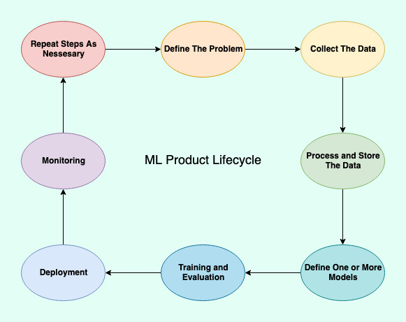

# The ML Product Lifecycle

Like other kinds of software, ML products are best built iteratively. Having a complete idea of what it will take to move your idea from your brain into a production server where it can benefit the masses **before you start** will increse the odds of the project's success. Additionally, being ruthlessly honest about the value the project will bring versus the cost and effort it will take can help you scrap a project before you waste too many person-hours and costly compute cycles.

Although the cycle above has arrows pointing in one direction, you should not hesistate to go backwards and repeat steps early on. For example, if you collect some data and, after cleaning the data in step three, determine it's not of good quality or that you need more you should probably collect more data before moving on to model definition.

Here are some ideas of what to think about during each of these phases.

## Define The Problem

* Approach the problem without prejudice about how to solve it.
    * Don't be a solution looking for a problem.
    * Focus on the people you want to help, not the tech you want to leverage.
    * Machine Learning might not be the right fit — **remain open to simpler/easier/less expensive solutions**!
* Get specific:
    * What kind of data will you need?
    * Where are you going to get get that data?
    * Explicitly define success, what metrics will tell you that you're succeeding?
* Be honest about the risks.
    * What will the consequences be when your model makes mistakes?
    * Will you have consent to use the data you need?
    * Are there legal issues involved?
* Be honest about the benefits.
    * Will success be game changing, or just an incremental improvement?
* Consider the impacts throughout development and production.
    * Do you need new infrastructure to support data storage and a data pipeline?
    * Do you need to implement a UI so that customers can use the model?
    * Do you need to insert the model into some existing infrastructure pipeline?
    * Which departments will need to be involved?
        * **Get them involved NOW not later**
* Collect opinions from a variety of sources, especially people who might be impacted by your product.
    * You have blind spots.
    * Talk to lots of people with lots different perspectives.
* Like most software anything is possible in the abstract but you have limited time and resources. 
    * Be ruthless about cutting scope and simplifying early. 

## Collect The Data

* You have a lot of options here:
    * Conduct surveys.
    * Use monitoring data from your application.
    * Buy data from data brokers.
    * Use open source datasets.
* Always always always examine the data yourself.
    * You will be liable for your product at the end of the day, so it is your responsibility to validate the data you use.
* Consider the ideas from lesson two while collecting the data:
    * Avoid class imbalance.
    * Does your data reflect bais in society? That bias will be passed on and possibly amplified by your model.
    * Ensure your sample is representative of the population that will use your model. 
    * Is there actually good reason to believe that there is a mathematicall mapping between your input data and your target lables?
    * Are there spurious corelations in the data? Your model can learn from any patterns, even if they're meaningless or coincidental.
    * Are there contextual clues in the data that could be learned *instead* of what you want the model to learn (e.g. Wolf vs Husky and a snowy background)
    
## Preprocess the Data

* Now that you have the data, you can tell if you need specialized datastores.
    * SQL might be perfectly reasonable!
    * Don't chase the new hotness if you don't need to.
    * Every new technology you add is complexity for your team, a little computational slowness can be worth developer effiecency.
* Reuse as much preprocessing as you can.
    * Much like separating OLTP and OLAP databases, you may want to separate datastores for the raw and preprocessed data.
* Carefully create a representative test set and training set.
    * Decide if you want to explicitly do this with a validation set, or do something like cross validation. 
* Keep in mind the 5 C's of Good data:
    * Correct
    * Consistent
    * Conforms (to the law)
    * Current
    * Consolidated
* Do you need separate datapaths for development and production?
    * Get DevOps, Data Scientists, and Application Engineers involved to find out.
    
## Define Models

* Now that you have the data, you have a better idea of which models might be successful!
* It's a good idea to build a few promising models.
    * You might want to ensemble them together in the end.
    * You might want to A/B test them.
    * You might find out a promising model totally fails on the test data.
    * But you should still set limits, you do ultimately have to go to market!
* Read some papers and look around at possible competitors.
    * Someone might have already solved a similar problem, start with their solution and improve it. 
    * Someone might have already failed to solve a similar problem, learn from their mistakes!
* Start simple and add complexity for incremental improvements. 
    * Simpler is faster, easier to understand and explain, easier to debug.
* Define, evaluate, and possibly go back to the data.
    * If nothing is working, you might need better data or a new problem.
    * Set limits on how long you're willing to persue a particular model.
    
## Evaluation

* Define success BEFORE you start the evaluation process.
    * Resist the urge to change the target unless you have **very good reasons**.
* Things to consider:
    * What is the impact of a false positive?
    * What is the impact of a false negative?
    * What is an acceptable failure rate?
    * **What are the consequences from success**?
* Start with smaller training sets to prove out the concept before committing to heavy duty training.
    * Consider early stopping and enable monitoring during the training process!
    * Nothing feels worse than a model that trained for days, cost a lot of money to train, and sucks real bad. 
* Patience is a virtue, but it's also okay to kill an experiment that isn't working.

## Deployment 

* Who has to interact with the model?
    * Define those interactions as explicitly as possible.
    * Do you need new UI components?
* How does a model go from untrained -> trained.
    * What infrastructure is required?
    * Where does the trained model live?
    * How much can you automate this process?
* How does a trained model, or it's predictions, reach a production system?
    * Is a copy of the model embeded in the app?
        * Then app deployment must check for new model versions!
        * But there will be integration requirements (e.g. both written in Python)
    * Does the model have it's own API and sever, separate from the app?
        * The app and the model can be deployed separately!
        * Fewer integration requirements, but more infrastructure concerns.
        * What happens if the API servers fail?
* Are you going to train the model continuously online or in batches?
    * Beware of adversarial inputs!
    * Consider the difficulty of versioning a continuously updated model. 
        * Keep snapshots to enable rollbacks.
        
## Monitoring

* Keep data about your model's predictions.
    * Make that data easily available in dashboards.
    * Try to turn it into new training data!
        * Can you label this data automatically? (e.g. users rate a movie you suggested)
        * Can a human easily tell if a prediction was right or wrong?
* Remember that the world can change.
    * Revisit your assumptions regularly.
* "The act of observation is not passive." 
    * Your system might change the ecosystem within which you operate.
    * Spam filtering is a war of attiriton, for example. 

## Repeat!

* Continous improvement is the name of the game. 
* New models, new data, and new infrastructure might become available.

# Practice / Case Studies

Consider the following problems as a possible opportunity for a machine learning system, and discuss what you should  to consider at each stage of the lifecycle:

### Credit Card Fraud Detection

Some non-exhaustive considerations:

* Data:
    * Beware of class imbalance, in the real world there are vastly more legit purchases than fraudulent ones. 
    * Your model probably needs to incorporate historical information about the individual whose card it is. 
* Definitely want to look beyond plain old accuracy:
    * False positives result in small annoyances: "hey, did you buy this?"
    * False negatives result in successful fraud, which is **much** worse!
* This is infrastructural, but you might also need some application specific code as well:
    * You probably want to automatically pause or maybe even just cancel the transaction.
    * Your employees need a dashboard.
    * Your customers will want to be notified, and probably want historical info too. 
* Consider the audience:
    * Are there cohorts of people who are more likely to be defrauded? 
    * Can we get data about them?
    * Learning about how fraudsters actually behave could also be quite useful in the early stages, and point us towards interesting ideas for putting together our training data.
* Are there easier ways to do this?
    * Some simpler preliminary checks might do a good job.
* Lots of companies are already doing this, find out what they're doing!!
* War of attrition — you'll improve then the fraudsters react then you have to improve more. 
    * So dashboards and regular monitoring should be prioritized. 

### Email Spam Detection

Some non-exhaustive considerations:

* Data:
    * Consider looking at metadata in addition to processing the contents of the email. 
    * The world of spam evolves quickly, you want to continuously collect new samples.
* Needs to be accurate, but lives aren't at stake:
    * False positive means your user doesn't get an important email.
    * False negative puts your user at risk of being phished.
    * Both are relatively small cost... the customer can look in the spam box and you can blame them for not being suspicious of a phishing email. 
* Mostly infrastructural, and when it works well you want it to be invisible. 
    * But you need to expose a SPAM box for your customers to check.
    * and you WANT a "mark as spam" feature to collect new training data.
* Simpler checks before running an expensive algorithm might help:
    * Check for links and run them through a reputation API
    * Same thing with the IP of the sender / email server
    * Check for high occurrence of typos / misspelled works with a standard spellcheck
    * You could also use these as "engineered features"
* Another war of attrition.

### Facial Recognition for Law Enforcement

* Data: 
    * Tons of potential legal issues here, if you want to pursue this you should hire a legal specialist.
    * Ideally, you want the tool to work with security footage which is usually at an awkward angle, building a training set with the right angle (or even better, MANY angles) will help.
    * Smart criminals also obscure their faces, so adversarial samples with glasses, bandanas, and other face coverings could also help.
    * Most state of the art systems display major racial bias in terms of accuracy (as of January 2020).
        * Be sure to get a dataset that is representative of the whole population. 
* Needs to be accurate, and especially should not deliver false positives. Lives are literally at stake:
    * False positives can potentially lead to false arrests or worse if the situation escalates.
    * False negatives might result in a criminal not getting caught — but police have plenty of other tactics they can try in this case. 
    * Beware the doppelgänger effect — some people genuinely look similar.
* User interface considerations:
    * Beware the over-confidence effect — if your system says "match" at 51% confidence you are misleading the police.
    * Users will not be highly technical and they will be highly motivated to track down "leads" your software provides.

### Image Based Cancer Screening

* Data:
    * There are LOTS of different machines that perform similar functions, but whose output will differ somewhat. You need lots of examples from all these machines, or different models for each machine. 
    * Rare cancers are rare, your system will only work well with LOTS of data. 
* User interface concerns:
    * Hospitals are notorious for not adopting technology, your system will have to be compelling and easy to use.
    * Simple classification is not that helpful, but segmentation / localization will be.
    * Might want to automate this to just run every time a machine prodces a new image, but you might want it to be on-demand. Consider the audience and try to perform some interviews to get a better idea of how to integrate the system. 
* Accuracy is again very critical:
    * False positive -> scare the shit out of some poor person who will now ALWAYS wonder if they have cancer or not. 
    * False negative -> someone who has cancer is not told they have cancer. 
    * An expert should ALWAYS vet EVERY prediction from such a system before a patient is given the output. Lives are on the line and there is serious legal liability.